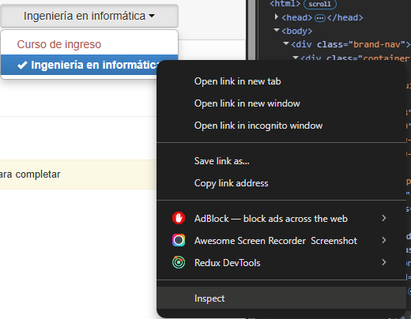
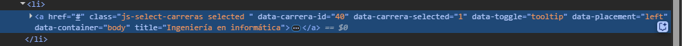

# 🎓 Avisame Nota - UCA

Script para monitorear cambios en las notas del SIU.

## 📋 Descripción

Este proyecto utiliza web scraping para monitorear automáticamente tu historia académica en el sistema Guaraní de la UCA y envía alertas por email cuando detecta cambios en las notas de las materias configuradas.

## 📦 Instalación

### Prerrequisitos

- Python 3.7+
- Google Chrome instalado
- Cuenta de Gmail para las alertas

### 1. Clonar el repositorio

```bash
git clone https://github.com/vSchiaffino/avisame-nota.git
cd avisame-nota
```

### 2. Instalar dependencias

```bash
pip install -r requirements.txt
```

### 3. Configurar variables de entorno

Copia el archivo de ejemplo y configura tus credenciales:

```bash
cp .env.example .env
```

Edita el archivo `.env` con tus datos:

```env
# Credenciales del campus UCA (EVA)
EVA_USERNAME=tu_email@uca.edu.ar
EVA_PASSWORD=tu_contraseña_del_campus

# Gmail para envío de alertas (ver seccion "Generar contraseña de aplicación")
GMAIL_USERNAME=tu_email@gmail.com
GMAIL_PASSWORD=tu_app_password_de_gmail

# Información de carrera (ver sección "Obtener datos de carrera")
CARRERA_ID=40
CARRERA_NOMBRE=Ingeniería en informática

# Materias a monitorear (códigos separados por comas)
SUBJECTS=GCO0529,GFF0889

# Frecuencia de revisión en minutos
FREQ_MINUTES=15
```

## 🏃‍♂️ Ejecución local

### Ejecutar el programa

```bash
python main.py
```

El programa:

1. Se conectará al sistema EVA de la UCA
2. Navegará al sistema Guaraní
3. Revisará tu historia académica
4. Comparará con el estado anterior
5. Enviará un email si detecta cambios
6. Esperará el tiempo configurado antes de repetir

## 📧 Configurar contraseña de aplicación de Gmail

Para que el sistema pueda enviar emails desde Gmail, necesitas generar una "contraseña de aplicación":

### 1. Habilitar verificación en 2 pasos

1. Ve a tu [cuenta de Google](https://myaccount.google.com/)
2. Selecciona **Seguridad** en el panel izquierdo
3. En "Iniciar sesión en Google", selecciona **Verificación en 2 pasos**
4. Sigue las instrucciones para habilitarla

### 2. Generar contraseña de aplicación

1. Una vez habilitada la verificación en 2 pasos, vuelve a **Seguridad**
2. En "Iniciar sesión en Google", selecciona **Contraseñas de aplicaciones**
3. Selecciona la aplicación: **Correo**
4. Selecciona el dispositivo: **Otro (nombre personalizado)**
5. Escribe: "Avisame Nota"
6. Haz clic en **Generar**
7. Copia la contraseña de 16 caracteres generada
8. Úsala como valor de `GMAIL_PASSWORD` en tu archivo `.env`

⚠️ **Importante**: Esta contraseña es diferente a tu contraseña normal de Gmail y solo funciona para aplicaciones.

## 🎯 Obtener datos de carrera

Para configurar correctamente `CARRERA_ID` y `CARRERA_NOMBRE`, necesitas obtener estos datos del sistema Guaraní:

### Obtener CARRERA_ID y CARRERA_NOMBRE (si es informática, simplemente usar el ejemplo)

Inspeccionar elemento

El valor del data-carrera-id (en este caso 40 es CARRERA_ID y el valor de title es CARRERA_NOMBRE, tiene que ser exactamente el mismo valor)


## ⚙️ Configuración avanzada

### Cambiar frecuencia de monitoreo

Modifica `FREQ_MINUTES` en tu archivo `.env`. Por ejemplo:

- `FREQ_MINUTES=5` → Revisa cada 5 minutos
- `FREQ_MINUTES=30` → Revisa cada 30 minutos
- `FREQ_MINUTES=60` → Revisa cada hora

### Agregar más materias

Agrega los códigos de materia separados por comas en `SUBJECTS` buscar en la historia académica el nombre de la catedra, por ejemplo:

Para Administración de Empresas (GAD0210) el id es GAD0210

```env
SUBJECTS=GCO0529,GFF0889,MAT0123,FIS0456
```
